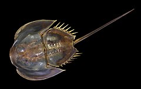

Skrzypłocz
=============

**Skrzypłocz** (*Limulus*), nazywany też *mieczogon* - stawonóg morski z rzędu ostrogonów (*Xiphosura*), ostatnich przedstawicieli gromady staroraków (*Merostomata*).

   A oto i on

